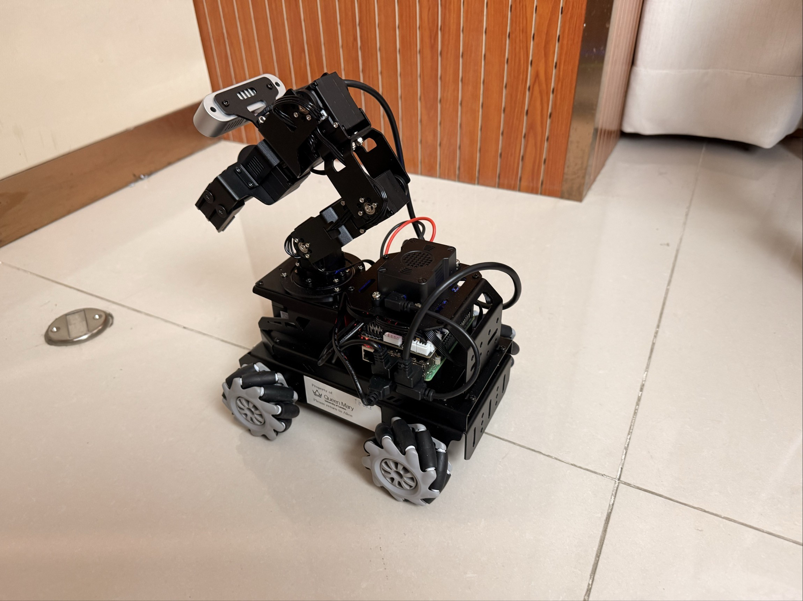
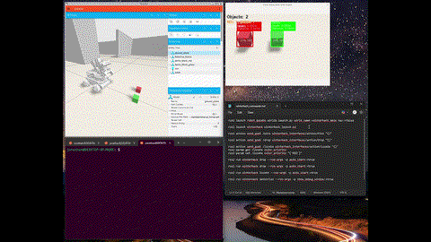
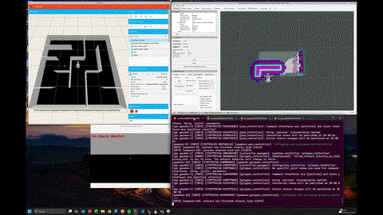

# WinterHack

WinterHack Challenge is an annual robotics-focused, challenge-based learning event hosted at Queen Mary University of London (QMUL). The 2026 challenge tasks participating teams with developing a fully autonomous mobile robot (AMR) to explore an unknown maze, detect coloured objects, retrieve them using a robotic arm, and return them safely to the start location.

This repository provides the official WinterHack ROS2 workspace, serving as the shared technical foundation for simulation, real-robot development, and the final on-site challenge. It is a WinterHack-specific, streamlined version, significantly reduced from the generic development repository: https://github.com/jonaloo19/ros2_humble_landerpi

 

## Ubuntu GPU guides
This section provides setup guides for Ubuntu (22.04) GPU configurations in dual-boot and WSL2 environments to ensure Gazebo and ROS2 run with hardware acceleration.

- [`ubuntu_gpu_guide/dual-boot-nvidia`](ubuntu_gpu_guide/dual-boot-nvidia/README.md): Ubuntu 22.04 dual-boot with Windows 11, native NVIDIA driver install, GPU acceleration checks, PRIME/hybrid graphics validation, and Gazebo launch guidance.
- [`ubuntu_gpu_guide/windows-wsl-nvidia`](ubuntu_gpu_guide/windows-wsl-nvidia/README.md): Ubuntu 22.04 on Windows 11 via WSL2, NVIDIA GPU passthrough with Mesa D3D12 setup, persistent GPU config, and a recommended Windows/WSL workflow.

## Install flow

1) Clone this repo (contains the install scripts and the `ros2_ws` workspace):
```bash
git clone https://github.com/jonaloo19/winterhack.git
cd winterhack
```

2) Install ROS2 Humble (skips if already present):
```bash
chmod +x install_ros2_humble.sh
./install_ros2_humble.sh
```

3) Install dependencies, copy the workspace to `~/ros2_ws`, and build:
```bash
chmod +x install_gazebo_landerpi.sh
./install_gazebo_landerpi.sh
```
This script installs the ROS2 + Gazebo tooling needed for simulation and navigation, copies the provided workspace into `~/ros2_ws`, builds it, and updates `~/.bashrc` with the workspace and Gazebo resource paths (plus a CPU-render fallback you can disable for GPU rendering).
 
After running, open a new terminal (or `source ~/.bashrc`) to load the environment.

## Workspace highlights (`ros2_ws/src`)
- `winterhack`: main package with mission logic and nodes (detect/locate/pick/drop), launch files, configs, maps, URDF, and RViz setup.
- `winterhack_interfaces`: action definitions for `Pick`, `Drop`, and `Locate`.
- `robot_gazebo`: Gazebo worlds and launch files (including `winterhack_maze`), models, and sim configs.
- `landerpi_description`: robot description package (URDF + meshes) used by Gazebo/RViz.
- `holonomic_sim`: holonomic base simulation plugin and test world used by the sim stack.
- `costmap_converter`, `teb_local_planner`, `trac_ik`: upstream nav/IK dependencies needed by the navigation and manipulation stack.

## Manual Workspace (ros2_ws) build
Use the provided colcon build command when you need to rebuild the workspace manually (for example, after developing a custom ROS application). Run:
```bash
cd ~/ros2_ws
colcon build --symlink-install
```
## Running WinterHack Demo

### Launch Gazebo world

1. This launches the `robocup_home` world to exercise the WinterHack base/arm manipulation workflow (locate, pick, drop).

```bash
ros2 launch robot_gazebo worlds.launch.py world_name:=robocup_home
```

Demo video (robocup_home): [video1.mp4](media/video1.mp4)



2. This launches the `winterhack_maze` world to exercise the full WinterHack AMR stack: navigation, base/arm manipulation, and the mission runner driving the search → locate → pick → retrieve → drop workflow

```bash
ros2 launch robot_gazebo worlds.launch.py world_name:=winterhack_maze
```


Demo video (winterhack_maze): [video2.mp4](media/video2.mp4)




---

### Launch WinterHack 

This launch brings up SLAM Toolbox, Nav2, MoveIt2, and the WinterHack ROS nodes/action servers for colour detection, locate, pick, and drop.

```bash
ros2 launch winterhack winterhack.launch.py
```

Note:  
`robot_mode:=sim` (default) uses `use_sim_time` (default `true`, `/clock`) and keeps the Gazebo control path for MoveIt; navigation outputs to `/controller/cmd_vel`.  
`robot_mode:=real` forces `use_sim_time:=false`, disables the Gazebo control path, enables real controllers, and publishes `/cmd_vel`.

---

### Mission Runner (Navigation and Manipulation)
Runs the end-to-end mission loop by coordinating navigation and manipulation: it searches for colour object, locates the object, performs pick, retrieves, and drops.

```bash
ros2 run winterhack mission_runner
```
Note: Requires WinterHack bringup running.

---

### Action Server Commands

1. Use these commands to exercise the `Pick` and `Drop` action servers launched in `winterhack.launch.py`, and observe the pick and drop behaviour.

```bash
ros2 action send_goal /pick winterhack_interfaces/action/Pick "{}"
```

```bash
ros2 action send_goal /drop winterhack_interfaces/action/Drop "{}"
```

2. Use these commands to exercise the `Locate` action server launched in `winterhack.launch.py`, and observe how color priority influences robot base alignment.

```bash
ros2 action send_goal /locate winterhack_interfaces/action/Locate "{}"
```

```bash
ros2 param get /locate color_priority
```

```bash
ros2 param set /locate color_priority "['RED']"
```

---

# Kill ROS
Stops existing ROS/Gazebo processes before relaunching to avoid conflicts like multiple action servers or duplicate topic publishers.
```bash
chmod +x killros.sh
```
Note: One-time setup to make the script executable.
```bash
./killros.sh
```
Note: Terminates running ROS/Gazebo processes.

## Summary
Start with a simulation world, then bring up WinterHack and run the mission runner to see the full demo. Use the action and parameter commands to try Pick/Drop/Locate yourself, and run the kill script if you need to reset ROS/Gazebo before another run.
