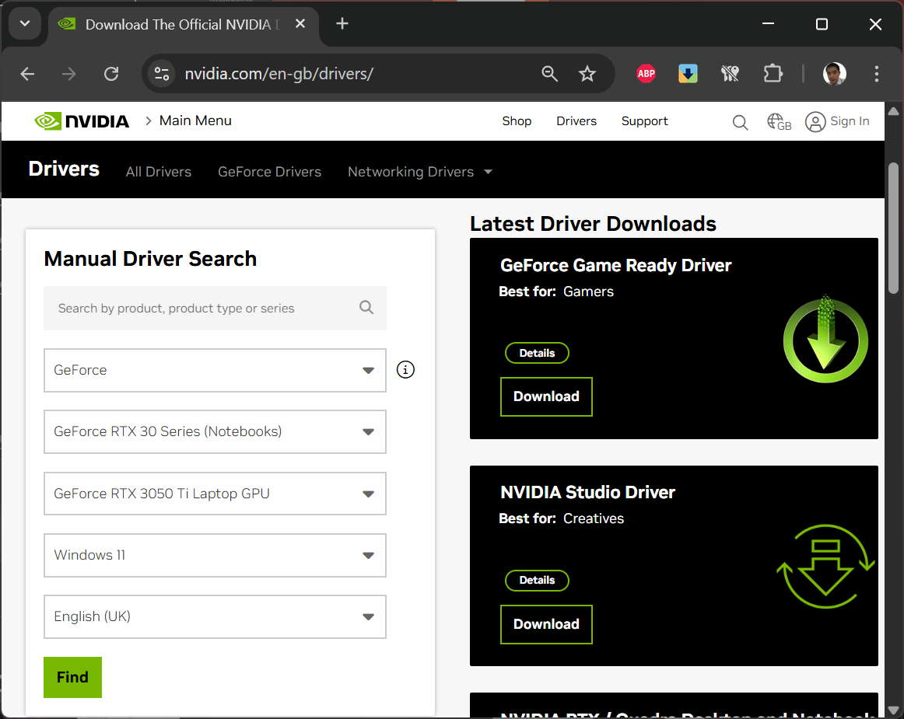
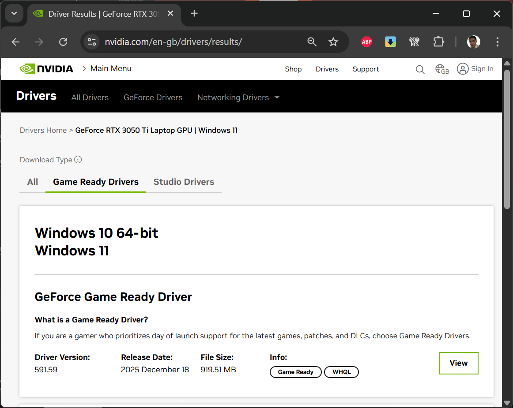
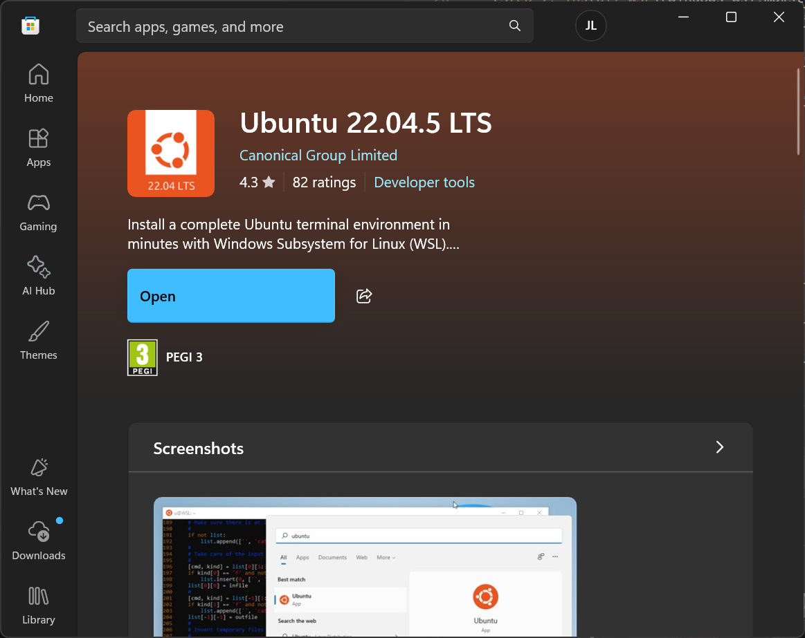
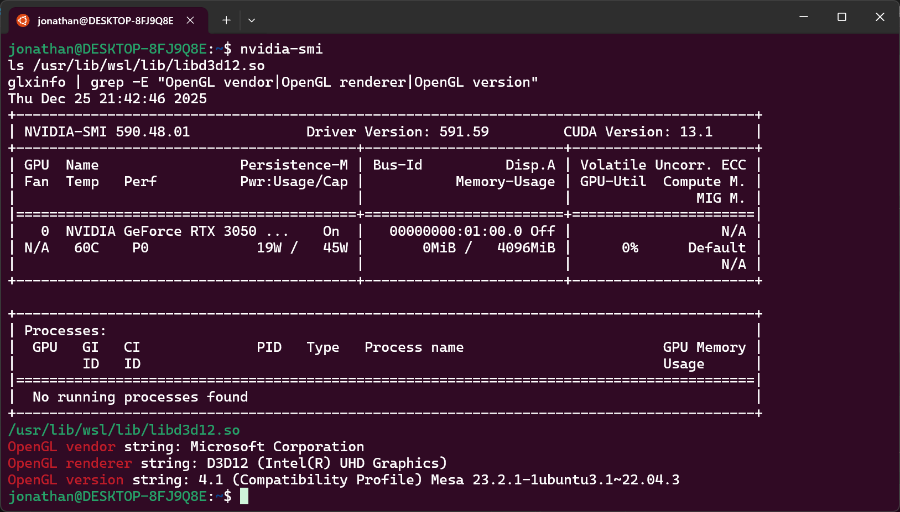
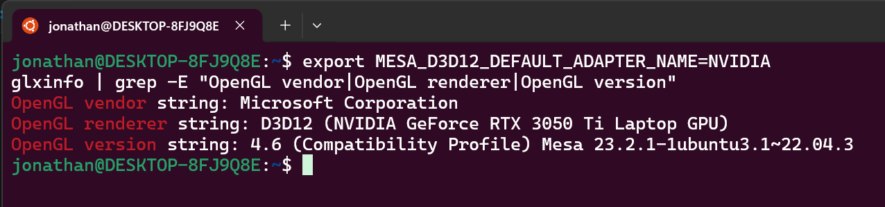
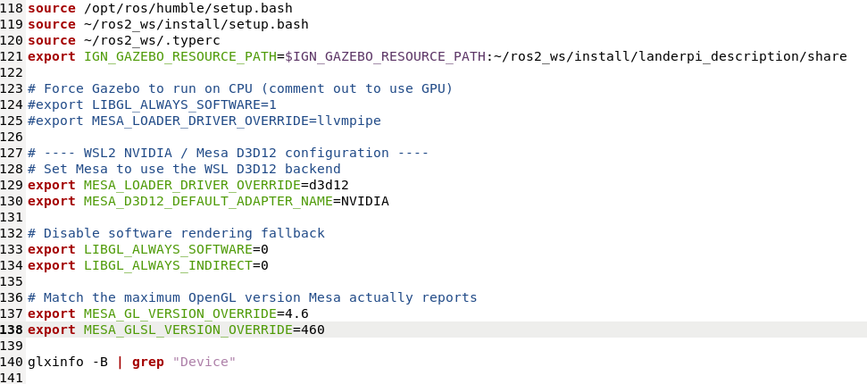
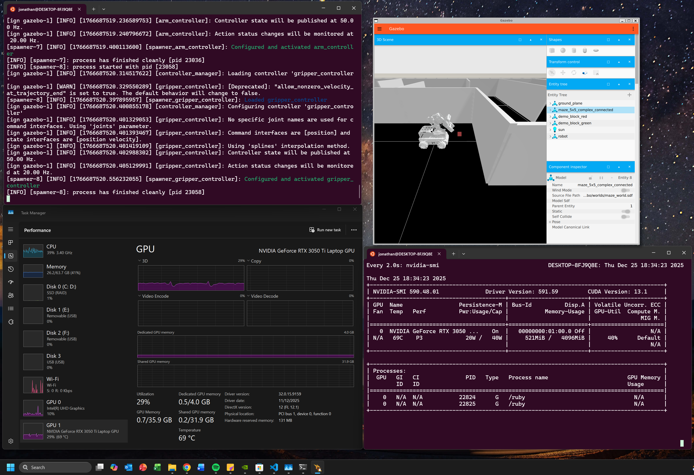
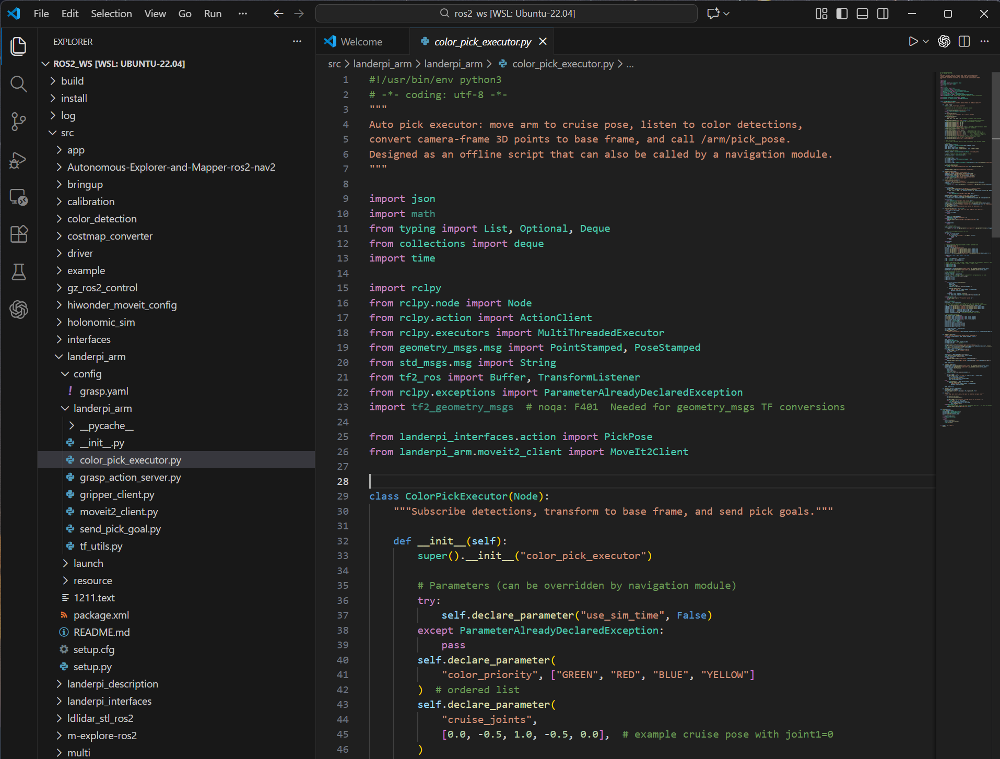

# Ubuntu 22.04 with NVIDIA GPU on Windows 11 (WSL2)

This guide provides a **step-by-step walkthrough** for deploying **Ubuntu 22.04.5 LTS with NVIDIA GPU acceleration** using **Windows Subsystem for Linux (WSL2)** on **Windows 11**.  
It is intended for users running **graphics-intensive Linux applications** (e.g. Gazebo, RViz, OpenGL tools, ROS) inside WSL.

---

## Machine Configuration Used

> The steps below are validated on the following hardware and software configuration.

- **Laptop:** Dell XPS 15 9510  
- **Host OS:** Windows 11 Pro (Build 26100)  
- **GPU:** NVIDIA GeForce RTX 3050 Ti (Laptop)  
- **NVIDIA Driver:** 591.59 (Windows)  
- **WSL Distribution:** Ubuntu 22.04.5 LTS  

> ⚠️ Other NVIDIA GPUs should work similarly, but behaviour may vary slightly depending on driver versions.

---

## Table of Contents

- [Step 1. Install NVIDIA GPU Driver on Windows 11](#step-1-install-nvidia-gpu-driver-on-windows-11)
- [Step 2. Install WSL](#step-2-install-wsl)
- [Step 3. Install Ubuntu 22.04](#step-3-install-ubuntu-2204)
- [Step 4. Configure NVIDIA GPU Support inside WSL](#step-4-configure-nvidia-gpu-support-inside-wsl)
- [Step 5. Recommended WSL–Ubuntu Workflow](#step-5-recommended-wslubuntu-workflow)

---

## Step 1. Install NVIDIA GPU Driver on Windows 11

> **Only required if your machine has an NVIDIA GPU.**  
> WSL GPU acceleration relies entirely on the **Windows-side NVIDIA driver**.

1. Visit the official NVIDIA driver download page:  
   https://www.nvidia.com/Download/index.aspx

2. Fill in your GPU details and click **Search**.



3. Download and install the latest recommended driver.



4. Reboot Windows after installation completes.

---

## Step 2. Install WSL

1. Open **PowerShell or Windows Terminal as Administrator**  
   (Right-click Start → *Terminal (Admin)*)

2. Run:
```bash
wsl --install
```

3. Restart your system when prompted.

For more details, see the official documentation:  
https://learn.microsoft.com/en-us/windows/wsl/install

---

## Step 3. Install Ubuntu 22.04

1. Open **Microsoft Store**
2. Search for **Ubuntu 22.04.5 LTS**
3. Click **Install**



4. Launch Ubuntu and complete the initial user setup.

---

## Step 4. Configure NVIDIA GPU Support inside WSL

When running Ubuntu inside **WSL2**, Linux applications **do not access the NVIDIA GPU directly**.  
Instead, GPU acceleration is provided via a **Windows-managed passthrough stack**.

### WSL GPU Rendering Architecture

```text
Linux OpenGL application (e.g. Gazebo, RViz, glxinfo)
        ↓
Mesa OpenGL driver (Linux user space)
        ↓
Mesa D3D12 backend
        ↓
Direct3D 12 (Windows)
        ↓
NVIDIA Windows GPU driver
        ↓
Physical NVIDIA GPU
```

---

### 4.1 Verify GPU Access from Ubuntu

Install Mesa utilities:

```bash
sudo apt update
sudo apt install mesa-utils -y
```

Check GPU visibility and the D3D12 bridge:

```bash
nvidia-smi
ls /usr/lib/wsl/lib/libd3d12.so
glxinfo | grep -E "OpenGL vendor|OpenGL renderer|OpenGL version"
```



---

### 4.2 Set Mesa to Use the NVIDIA Adapter

```bash
export MESA_D3D12_DEFAULT_ADAPTER_NAME=NVIDIA
glxinfo | grep -E "OpenGL vendor|OpenGL renderer|OpenGL version"
```



---

### 4.3 Make GPU Configuration Persistent

Add the following to your `~/.bashrc`:

```bash
# ---- WSL2 NVIDIA / Mesa D3D12 configuration ----

# Set Mesa to use the D3D12 backend
export MESA_LOADER_DRIVER_OVERRIDE=d3d12
export MESA_D3D12_DEFAULT_ADAPTER_NAME=NVIDIA

# Disable software rendering fallback
export LIBGL_ALWAYS_SOFTWARE=0
export LIBGL_ALWAYS_INDIRECT=0

# Match Mesa-reported OpenGL capabilities
export MESA_GL_VERSION_OVERRIDE=4.6
export MESA_GLSL_VERSION_OVERRIDE=460
```

Reload and verify:

```bash
source ~/.bashrc
glxinfo -B | grep "Device"
```



---

### 4.4 Expected Result

If configured correctly, GPU-accelerated applications (e.g. Gazebo) should render **smoothly**, comparable to native Linux performance.

▶️ **Example Gazebo Rendering**

[](video1.mp4)

---

## Step 5. Recommended WSL–Ubuntu Workflow

To improve usability and development productivity inside WSL Ubuntu, the following tools are recommended:

### 5.1 Text Editor
```bash
sudo apt install gedit -y
```

### 5.2 File Manager (GNOME Nautilus)
```bash
sudo apt install nautilus -y
```

### 5.3 Visual Studio Code Integration
VS Code provides seamless WSL integration for Linux development workflows, including ROS development. Official guide: https://learn.microsoft.com/en-us/windows/wsl/tutorials/wsl-vscode



---

## Notes

- **Do NOT install NVIDIA Linux drivers inside WSL**
- All GPU support is provided by **Windows drivers + WSL D3D12**
- This setup works for **OpenGL-based tools** (Gazebo, RViz, GLX apps)
- CUDA workloads are supported separately via `nvidia-smi` passthrough

---

